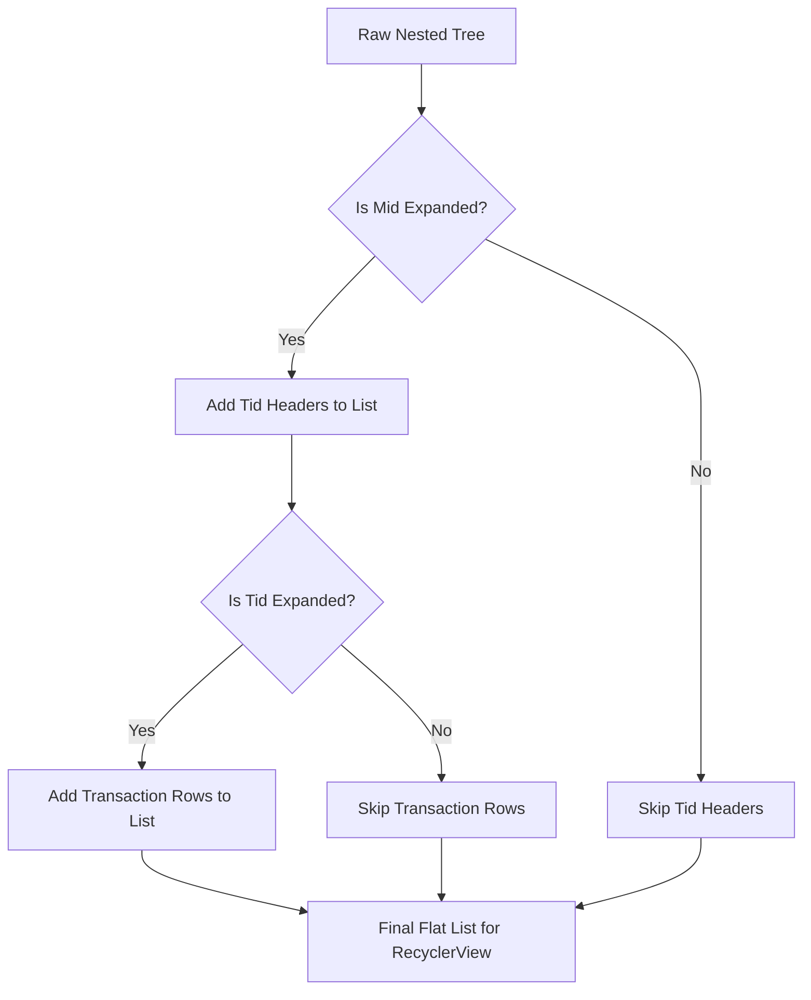

# Expandable Transaction List Architecture Documentation

This repository contains an Android application demonstrating an expandable transaction list. The solution is built with **MVVM** (Model-View-ViewModel) and **Clean Architecture** principles to ensure modularity, testability, and a clear separation of concerns.

---

## 1. Architecture Overview (Clean Architecture + MVVM)

The project is structured into three distinct layers:

### Data Layer (`data` package)
Responsible for providing data from external or internal sources.
*   **`TransactionLocalDataSource`**: Reads the raw `transactions.json` from the Android `assets` directory and parses it using `org.json.JSONObject`.
*   **`TransactionRowDto`**: The Data Transfer Object mapping directly to the JSON structure.
*   **`TransactionRepositoryImpl`**: Bridges the data source to the domain layer. It fetches the `TransactionRowDto` objects and converts them into the domain model `TransactionRow`.

### Domain Layer (`domain` package)
The core business logic of the application. It contains **no dependencies** on the Android framework or UI components.
*   **Models**: Defines the pure Kotlin data structures `TransactionRow`, `TransactionEntry`, `TidGroup`, and `MidGroup`.
*   **`TransactionRepository` (Interface)**: Defines the contract for fetching transaction data.
*   **`GroupTransactionsUseCase`**: The core logic component. It transforms a flat list of `TransactionRow` objects into a nested, hierarchical structure (`Mid` -> `Tid` -> `Entries`) required for the UI.

### Presentation Layer (`presentation` package)
Responsible for UI state management and view rendering.
*   **`TransactionViewModel`**: Manages screen state using Kotlin `StateFlow`. It keeps track of which `Mid` and `Tid` sections are currently expanded or collapsed by the user.
*   **`TransactionViewModelFactory`**: A custom factory for manual dependency injection (DataSource -> Repository -> UseCase -> ViewModel).
*   **`TransactionActivity`**: The main screen that observes the ViewModel's state and submits the flattened transaction list to the adapter.
*   **`ExpandableTransactionAdapter`**: A `ListAdapter` that handles multiple view types (Mid Header, Tid Header, Transaction Row) to render the final expandable list.

---

## 2. The Grouping Logic (`GroupTransactionsUseCase`)

The raw JSON file provides a flat array of objects, each containing a `Mid`, `Tid`, `amount`, and `narration`. 

To create the hierarchical structure, the use case performs the following steps:
1.  **Group by Mid**: Groups the flat list by the `Mid` property (`groupBy { it.mid }`).
2.  **Sort Mid**: Sorts the Mids in ascending order (`toSortedMap()`).
3.  **Group by Tid (Nested)**: For every Mid group, it takes the associated rows and groups them by `Tid`.
4.  **Sort Tid**: Sorts the Tids in ascending order.
5.  **Map to Models**: Maps the sorted data into our strongly-typed object hierarchy (`MidGroup` -> `TidGroup` -> `TransactionEntry`).

---

## 3. The Flattening Logic (`TransactionViewModel`)

A `RecyclerView` cannot render a nested tree structure directly; it expects a **flat, 1D list**. 

The `TransactionViewModel` takes the nested `MidGroup` tree and "flattens" it into a single list of `ListItem` objects based on the user's expansion state.

When a user clicks on a Mid or Tid header:
1.  The click event triggers the `ViewModel`.
2.  The `ViewModel` updates its internal `expandedMids` or `expandedTids` sets.
3.  The `refreshFlattenedList()` function runs, recalculating the flat list.
4.  The new list is emitted via `StateFlow`, triggering the `RecyclerView` to visually update.

---

## 4. Multiple View Types in RecyclerView

Because the flat list contains different types of data, the `ExpandableTransactionAdapter` handles three distinct view types:
1.  **`VIEW_TYPE_MID`**: Inflates `item_mid_header.xml` (Grey background, bold title).
2.  **`VIEW_TYPE_TID`**: Inflates `item_tid_header.xml` (Light grey background, slightly indented).
3.  **`VIEW_TYPE_ROW`**: Inflates `item_transaction_row.xml` (White background, deeply indented, displays amount and narration).

The adapter determines the correct layout to inflate by checking the underlying `ListItem` sealed class type (`ListItem.MidHeader`, `ListItem.TidHeader`, or `ListItem.TransactionRowItem`).
